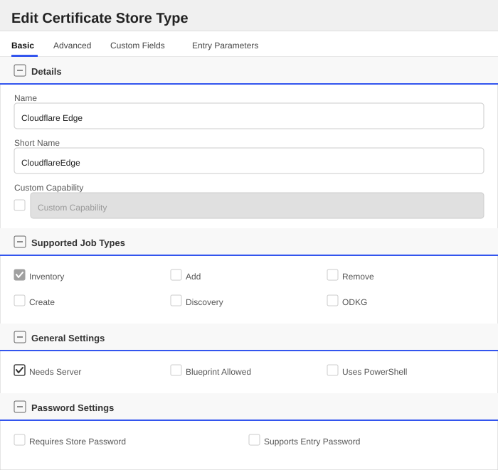
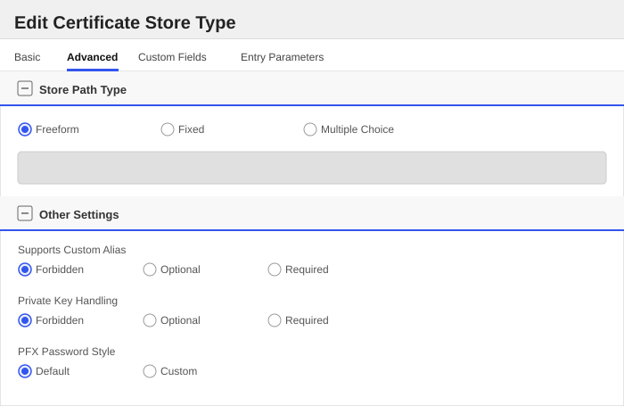
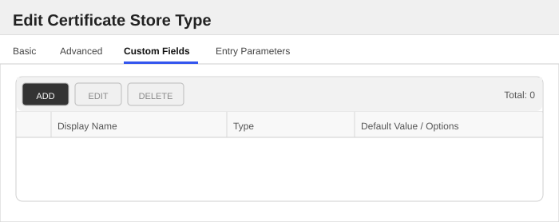
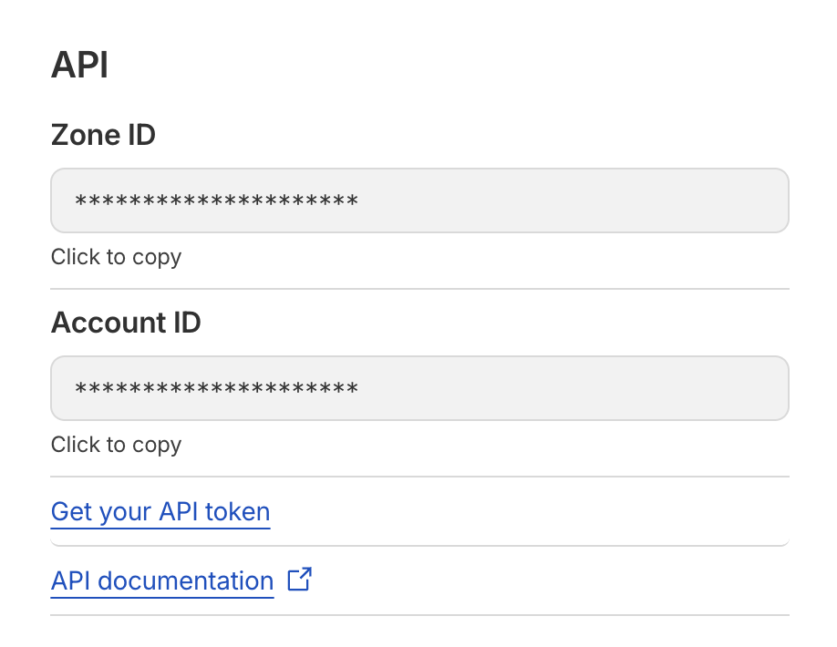

<h1 align="center" style="border-bottom: none">
    Cloudflare Edge Universal Orchestrator Extension
</h1>

<p align="center">
  <!-- Badges -->

<a href="https://github.com/Keyfactor/Cloudflare Edge Orchestrator/releases"></a>


</p>

<p align="center">
  <!-- TOC -->
  <a href="#support">
    <b>Support</b>
  </a>
  ·
  <a href="#installation">
    <b>Installation</b>
  </a>
  ·
  <a href="#license">
    <b>License</b>
  </a>
  ·
  <a href="https://github.com/orgs/Keyfactor/repositories?q=orchestrator">
    <b>Related Integrations</b>
  </a>
</p>

## Overview

The Cloudflare Edge Orchestrator Extension is an integration that can inventory [Cloudflare Edge certificates](https://developers.cloudflare.com/ssl/concepts/#edge-certificate).

## Compatibility

This integration is compatible with Keyfactor Universal Orchestrator version 11.0 and later.

## Support

The Cloudflare Edge Universal Orchestrator extension is supported by Keyfactor. If you require support for any issues or have feature request, please open a support ticket by either contacting your Keyfactor representative or via the Keyfactor Support Portal at https://support.keyfactor.com.

> If you want to contribute bug fixes or additional enhancements, use the **[Pull requests](../../pulls)** tab.

## Requirements & Prerequisites

Before installing the Cloudflare Edge Universal Orchestrator extension, we recommend that you install [kfutil](https://github.com/Keyfactor/kfutil). Kfutil is a command-line tool that simplifies the process of creating store types, installing extensions, and instantiating certificate stores in Keyfactor Command.

To inventory certificates, the Universal Orchestrator instance **must** be able to reach the server hosting the certificate over the network.  
Cloudflare's API does not provide the certificate contents, so the extension fetches the certificate directly from the server using a TLS handshake (via OpenSSL).

### Authentication and Authorization

When configuring the certificate store, the server password will contain the API token used to access the Cloudflare API. This can be either an **Account API Token** or a **User API Token**. See the [guide on how to create an API token](https://developers.cloudflare.com/fundamentals/api/get-started/create-token/).

The API token must have the following permissions:

|Permission|Required|Documentation|
|--|--|--|
|Account:SSL|Yes|[List Certificate Packs](https://developers.cloudflare.com/api/resources/ssl/subresources/certificate_packs/methods/list/)|
|Certificates:Read|Yes|[List Certificate Packs](https://developers.cloudflare.com/api/resources/ssl/subresources/certificate_packs/methods/list/)|

## CloudflareEdge Certificate Store Type

To use the Cloudflare Edge Universal Orchestrator extension, you **must** create the CloudflareEdge Certificate Store Type. This only needs to happen _once_ per Keyfactor Command instance.


#### Supported Operations

| Operation    | Is Supported |
|--------------|--------------|
| Add          | 🔲 Unchecked |
| Remove       | 🔲 Unchecked |
| Discovery    | 🔲 Unchecked |
| Reenrollment | 🔲 Unchecked |
| Create       | 🔲 Unchecked |

#### Store Type Creation

##### Using kfutil:
`kfutil` is a custom CLI for the Keyfactor Command API and can be used to create certificate store types.
For more information on [kfutil](https://github.com/Keyfactor/kfutil) check out the [docs](https://github.com/Keyfactor/kfutil?tab=readme-ov-file#quickstart)

   <details><summary>Click to expand CloudflareEdge kfutil details</summary>

   ##### Using online definition from GitHub:
   This will reach out to GitHub and pull the latest store-type definition
   ```shell
   # Cloudflare Edge
   kfutil store-types create CloudflareEdge
   ```

   ##### Offline creation using integration-manifest file:
   If required, it is possible to create store types from the [integration-manifest.json](./integration-manifest.json) included in this repo.
   You would first download the [integration-manifest.json](./integration-manifest.json) and then run the following command
   in your offline environment.
   ```shell
   kfutil store-types create --from-file integration-manifest.json
   ```
   </details>

#### Manual Creation
Below are instructions on how to create the CloudflareEdge store type manually in
the Keyfactor Command Portal

   <details><summary>Click to expand manual CloudflareEdge details</summary>

   Create a store type called `CloudflareEdge` with the attributes in the tables below:

   ##### Basic Tab
   | Attribute | Value | Description |
   | --------- | ----- | ----- |
   | Name | Cloudflare Edge | Display name for the store type (may be customized) |
   | Short Name | CloudflareEdge | Short display name for the store type |
   | Capability | CloudflareEdge | Store type name orchestrator will register with. Check the box to allow entry of value |
   | Supports Add | 🔲 Unchecked | Indicates that the Store Type supports Management Add |
   | Supports Remove | 🔲 Unchecked | Indicates that the Store Type supports Management Remove |
   | Supports Discovery | 🔲 Unchecked | Indicates that the Store Type supports Discovery |
   | Supports Reenrollment | 🔲 Unchecked | Indicates that the Store Type supports Reenrollment |
   | Supports Create | 🔲 Unchecked | Indicates that the Store Type supports store creation |
   | Needs Server | ✅ Checked | Determines if a target server name is required when creating store |
   | Blueprint Allowed | 🔲 Unchecked | Determines if store type may be included in an Orchestrator blueprint |
   | Uses PowerShell | 🔲 Unchecked | Determines if underlying implementation is PowerShell |
   | Requires Store Password | 🔲 Unchecked | Enables users to optionally specify a store password when defining a Certificate Store. |
   | Supports Entry Password | 🔲 Unchecked | Determines if an individual entry within a store can have a password. |

   The Basic tab should look like this:

   

   ##### Advanced Tab
   | Attribute | Value | Description |
   | --------- | ----- | ----- |
   | Supports Custom Alias | Forbidden | Determines if an individual entry within a store can have a custom Alias. |
   | Private Key Handling | Forbidden | This determines if Keyfactor can send the private key associated with a certificate to the store. |
   | PFX Password Style | Default | 'Default' - PFX password is randomly generated, 'Custom' - PFX password may be specified when the enrollment job is created (Requires the Allow Custom Password application setting to be enabled.) |

   The Advanced tab should look like this:

   

   > For Keyfactor **Command versions 24.4 and later**, a Certificate Format dropdown is available with PFX and PEM options. Ensure that **PFX** is selected, as this determines the format of new and renewed certificates sent to the Orchestrator during a Management job. Currently, all Keyfactor-supported Orchestrator extensions support only PFX.

   ##### Custom Fields Tab
   Custom fields operate at the certificate store level and are used to control how the orchestrator connects to the remote target server containing the certificate store to be managed. The following custom fields should be added to the store type:

   | Name | Display Name | Description | Type | Default Value/Options | Required |
   | ---- | ------------ | ---- | --------------------- | -------- | ----------- |

   The Custom Fields tab should look like this:

   

   </details>

## Installation

1. **Download the latest Cloudflare Edge Universal Orchestrator extension from GitHub.**

    Navigate to the [Cloudflare Edge Universal Orchestrator extension GitHub version page](https://github.com/Keyfactor/Cloudflare Edge Orchestrator/releases/latest). Refer to the compatibility matrix below to determine which asset should be downloaded. Then, click the corresponding asset to download the zip archive.

   | Universal Orchestrator Version | Latest .NET version installed on the Universal Orchestrator server | `rollForward` condition in `Orchestrator.runtimeconfig.json` | `Cloudflare Edge Orchestrator` .NET version to download |
   | --------- | ----------- | ----------- | ----------- |
   | Older than `11.0.0` | | | `net6.0` |
   | Between `11.0.0` and `11.5.1` (inclusive) | `net6.0` | | `net6.0` |
   | Between `11.0.0` and `11.5.1` (inclusive) | `net8.0` | `Disable` | `net6.0` |
   | Between `11.0.0` and `11.5.1` (inclusive) | `net8.0` | `LatestMajor` | `net8.0` |
   | `11.6` _and_ newer | `net8.0` | | `net8.0` |

    Unzip the archive containing extension assemblies to a known location.

    > **Note** If you don't see an asset with a corresponding .NET version, you should always assume that it was compiled for `net6.0`.

2. **Locate the Universal Orchestrator extensions directory.**

    * **Default on Windows** - `C:\Program Files\Keyfactor\Keyfactor Orchestrator\extensions`
    * **Default on Linux** - `/opt/keyfactor/orchestrator/extensions`

3. **Create a new directory for the Cloudflare Edge Universal Orchestrator extension inside the extensions directory.**

    Create a new directory called `Cloudflare Edge Orchestrator`.
    > The directory name does not need to match any names used elsewhere; it just has to be unique within the extensions directory.

4. **Copy the contents of the downloaded and unzipped assemblies from __step 2__ to the `Cloudflare Edge Orchestrator` directory.**

5. **Restart the Universal Orchestrator service.**

    Refer to [Starting/Restarting the Universal Orchestrator service](https://software.keyfactor.com/Core-OnPrem/Current/Content/InstallingAgents/NetCoreOrchestrator/StarttheService.htm).

> The above installation steps can be supplemented by the [official Command documentation](https://software.keyfactor.com/Core-OnPrem/Current/Content/InstallingAgents/NetCoreOrchestrator/CustomExtensions.htm?Highlight=extensions).

## Defining Certificate Stores

### Store Creation

#### Manually with the Command UI

<details><summary>Click to expand details</summary>

1. **Navigate to the _Certificate Stores_ page in Keyfactor Command.**

    Log into Keyfactor Command, toggle the _Locations_ dropdown, and click _Certificate Stores_.

2. **Add a Certificate Store.**

    Click the Add button to add a new Certificate Store. Use the table below to populate the **Attributes** in the **Add** form.

   | Attribute | Description |
   | --------- | ----------- |
   | Category | Select "Cloudflare Edge" or the customized certificate store name from the previous step. |
   | Container | Optional container to associate certificate store with. |
   | Client Machine | The account identifier for the Cloudflare account to be used for connecting to the Cloudflare API. |
   | Store Path | The zone identifier for the Cloudflare zone where the edge certificates are located. |
   | Orchestrator | Select an approved orchestrator capable of managing `CloudflareEdge` certificates. Specifically, one with the `CloudflareEdge` capability. |

</details>

#### Using kfutil CLI

<details><summary>Click to expand details</summary>

1. **Generate a CSV template for the CloudflareEdge certificate store**

    ```shell
    kfutil stores import generate-template --store-type-name CloudflareEdge --outpath CloudflareEdge.csv
    ```
2. **Populate the generated CSV file**

    Open the CSV file, and reference the table below to populate parameters for each **Attribute**.

   | Attribute | Description |
   | --------- | ----------- |
   | Category | Select "Cloudflare Edge" or the customized certificate store name from the previous step. |
   | Container | Optional container to associate certificate store with. |
   | Client Machine | The account identifier for the Cloudflare account to be used for connecting to the Cloudflare API. |
   | Store Path | The zone identifier for the Cloudflare zone where the edge certificates are located. |
   | Orchestrator | Select an approved orchestrator capable of managing `CloudflareEdge` certificates. Specifically, one with the `CloudflareEdge` capability. |

3. **Import the CSV file to create the certificate stores**

    ```shell
    kfutil stores import csv --store-type-name CloudflareEdge --file CloudflareEdge.csv
    ```

</details>

> The content in this section can be supplemented by the [official Command documentation](https://software.keyfactor.com/Core-OnPrem/Current/Content/ReferenceGuide/Certificate%20Stores.htm?Highlight=certificate%20store).


## Configuring the Certificate Store

When setting up your certificate store, you will be required to fill in the following properties on your certificate store:

|Name|Value|
|--|--|
|Client Machine|Account ID|
|Store Path|Zone ID|
|Server Username|<not used, can be set to No Value or an arbitrary value>|
|Server Password|Either your Account API Token or User API Token|

You can find your account ID and zone ID on the Cloudflare dashboard, located under your Account. Please refer to the [Cloudflare documentation](https://developers.cloudflare.com/fundamentals/account/find-account-and-zone-ids/) for more information.



## License

Apache License 2.0, see [LICENSE](LICENSE).

## Related Integrations

See all [Keyfactor Universal Orchestrator extensions](https://github.com/orgs/Keyfactor/repositories?q=orchestrator).
